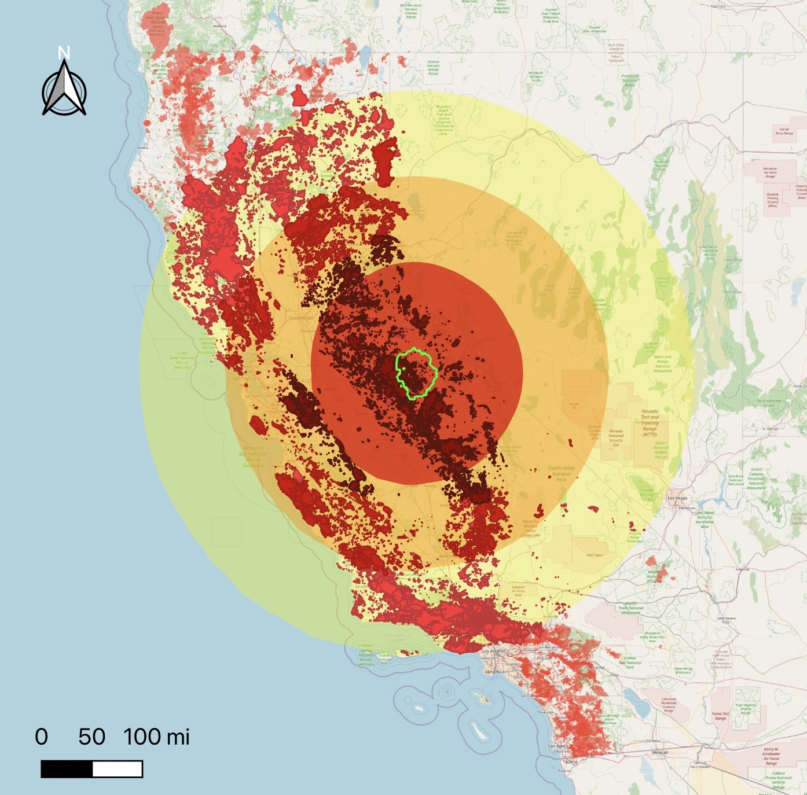

\newpage
\listoftables 
\newpage
\listoffigures 
\newpage

# Rationale and Research Questions

Wildfire activity in California has increased five-fold since the 1970s. This is largely due to the drying of vegetation that serves as fuel for fire as climate change causes temperatures to rise. Scientists predict that the intensity and frequency of wildfire will continue to increase as climate change persists and the population of people living in wildland areas increases. 

Yosemite National Park is the most visited national park in California and has experienced impacts on natural and recreational resources due to increasing visitation. Fire has also shaped the landscape in Yosemite for thousands of years. However, due to the combination of land management practices like fire suppression and the impact of climate change, fire frequency and extent have increased in the last several decades. Extensive fires can result in poor air quality and park closures, which could result in reduced visitation numbers in years with frequent and severe fire events. 

To understand the relationship between visitation and wildfire in Yosemite, we explore the following research questions: **Did wildfire frequency and size affect recreational visitation in Yosemite National Park between 1999 and 2019?** To better understand changes in visitation and wildfire we also examine the research question: **Has there been an increasing or decreasing visitation and wildfire frequency in Yosemite National Park between 1999 and 2019?**

\newpage
# Dataset Information
The [California Fire Perimeters](https://gis.data.ca.gov/datasets/CALFIRE-Forestry::california-fire-perimeters-all/explore?location=37.260012%2C-118.992700%2C6.00&showTable=true) include California's wildfires since the early 20th century. The dataset is provided by California Department of Forestry and Fire Protection.

The [National Park Service VUStats Dataset](https://irma.nps.gov/STATS/Reports/Park/YOSE) provides visitation data for every national park unit and is updated on a monthly basis by NPS staff. 

# Data Preparation and Exploratory Analysis
```{r setup, include=FALSE}
library(tidyverse)
library(lubridate)
library(dplyr)
library(plyr)
library(broom)
library(nlme)
library(ggnewscale)
library(readr)
library(knitr)
knitr::opts_chunk$set(
  echo = FALSE, message = FALSE, warning = FALSE
)

```

```{r include=FALSE}
source("Code/DataWrangling.R")
source("Code/DataExploration.R")
source("Code/analysis.R")
```

## Fire Data Wrangling and Exploratory Analysis

The wildfire data is stored in the California Fire Perimeters dataset as polygons within a shapefile. Since one of our research questions is to study the relationships between wildfire around the Yosemite National Park and the recreational visits, we first used ArcGIS to extract wildfire polygons within a buffer zone around the Yosemite National Park. By looking back to the AQI heatmaps for previous fire seasons, we roughly estimated the average impact area of wildfires in California and decided to use 300 miles as the distance of the buffer zone (see Figure \@ref(fig:buffer)  & \@ref(fig:AQI) in Appendix). 
After we imported wildfire data into R, we selected only fire extent and recorded time and excluded records without either of these two values. We then formed a new dataset by summarizing fire counts and sum extent by month.
Figure \@ref(fig:FireExp1) plot all the individual wildfires from 1999 to 2019.

```{r FireExp1, fig.cap="Wildfires within 300 miles buffer zone near Yosemite (1909 to 2019"}
print(fireplot)
```

## Visitation data wrangling & exploratory analysis
After viewing the visitation data, we wrangeled the dataset using the pivotlonger command to create a tidy dataset, for easier analysis. Since we were interested in analyzing trends over time, we created a date column using the lubridate function. 
```{r Wrangling table, echo=FALSE}
visit2 <- head(Visitation_by_month_gathered)
knitr::kable(visit2, col.names = c('Year', 'Month', 'Recreational Visits', 'Date'))
```

Once the dataset was tidy and data wrangling was finalized, we performed some preliminary data exploration. We used simple functions like head() and summary() to examine the tidy dataset. Using ggplot2, we created two scatterplots to help us understand visitation trends. Figure \@ref(fig:VisitDataExp1) visualized general visitation trends between 1999 and 2019. Based on the plot and regression line, overall visitation to Yosemite National Park is generally increasing, which is consistent with National Park Service's website. Figure \@ref(fig:VisitDataExp2) displays visitation to Yosemite between 2019-2019 grouped by month and shows clear seasonality, with peak season between June and August and shoulder seasons with lower visitation between September and May.  

```{r VisitDataExp1, fig.cap="Visitation trends between 1999 and 2019"}
print(Visitation_by_month_plot)
```

```{r VisitDataExp2, fig.cap="Visitation to Yosemite between 2019-2019 (by month)"}
print(visitation_by_month_plot2)
```

\newpage

# Analysis

## Question 1: Time Series analysis

To better understand the trend of wildfire and recreational visitation in Yosemite through time, we conducted time series analysis for each dataset separately. 

### Timeseries analysis for fire data

We fist analysed the general and decomposed (seasonal) trend of wildfire data.
Figure \@ref(fig:TSplotfire) shows that the wildfire around Yosemite National Park has a clear seasonal trend and had 3 peaks during the last 20 years. One unexpected phenomenon is that, as Figure \@ref(fig:FireExp1) above showed, more larger fires have been recorded after 2000, but the time series analysis here indicates a drop in sum fire extent at the very end of the 20-year period. After checking the processed dataset, we also confirmed a similar drop in fire counts. One possible explanation for these is that there is more incomplete records in 2019 and were dropped in both data selecting and wrangling steps. 

```{r TSplotfire, fig.cap="Time Series analysis for wilfire data in Yosemite (1999-2019)"}
plot(fire.Decomposed, main = "Fire Extent Decomposed")
```

### Time Series Analysis of Visitation Data

We performed a time series analysis of visitation data to understand the overall trend to examine whether there is an increasing or decreasing visitation trend for Yosemite National Park between 1999 and 2019. Based on the decomposed plot (Fig.\@ref(fig:TSplotvisit)) of the data, the data has seasonality and is trending downwards. 

Since the decreasing trend was not consistent with our initial exploratory analysis and plot of the data, we computed the mean annual visitation rate and performed a Mann-Kendall analysis annual visitation. The p-value is less than 0.05, so we reject the null hypothesis that the data is stationary, therefore we have a trend over time. Visitation appears to be decreasing over time in Yosemite National Park.

```{r TSplotvisit, fig.cap="Time Series analysis for visitation data in Yosemite (1999-2019)"}
plot(Visitation_by_month_Decomposed)
```

## Question 2: Modeling relationship between visitation and fire

We used a multiple linear regression to test our research question regarding the relationship between visitation and fire around Yosemite. We first looked at the correlation plot (Fig. \@ref(fig:corrplot)) of the variables and decided to include year, month, sum fire extent, and fire counts as independent variables in our model.

```{r corrplot, fig.cap="Correlation plot for wildfire, time, and visitation."}
corrplot(yosecorr,method = "number",insig = "label_sig",
         sig.level = c(.05))
```

Since we already seen a nonlinear trend of visitation through months, we set month  as factor for our model. Using the step wise method, the independent variables left in the reduced model include fire counts and month. According to the statistical test, fire counts and several specific months are significant. 
Table \@ref(tab:regression) below only includes some of the significant variables from the reduced model, the full regression result see Table \@ref(tab:regressionF) in appendix. The adjusted R-square for the model is 0.9103, which indicates that over 91% of data is fit by the regression model.
```{r regression}
lm(data=yosefire, Visits ~ as.factor(Month) + Firecounts) %>%
  tidy()%>%
  slice(1,7:10,13)%>%
  kable(caption = "Regression table for the reduced model. ",
    col.names = c("Predictor", "Estimate", "SE", "t statistic", "p value"),
    digits = c(0, 1, 1, 2, 3))
```

Finally, we compared the model fitted value with actual fire extent. The comparison is shown in Fig. \@ref(fig:fitplot). The plot suggests that our model captured most of the variation of recreational visitation but still missed some peaks.

```{r fitplot, fig.cap="Comparision of linear model fitting result and actual fire extent."}
print(modelplot)  
```

\newpage
# Summary and Conclusions
This study aimed to find the relationship between wildfire frequency and size and recreational visitation to Yosemite National Park from 1999 to 2019.    
Through time series analysis, we found that the wildfire around Yosemite National Park has a clear seasonal trend and had 3 peaks during the last 20 years. The recreational visitation in Yosemite National Park also has seasonality and is trending downwards.     

By testing linear models with the stepwise method, we concluded that monthly fire counts and month of the year are significant in explaining variation of recreational visitation while year and monthly sum of fire extent were not. The result suggest that fire counts may have greater impact on people's outdoor plan than fire size and people might be more sensitive to high fires frequency comparing to larger fires. This might indicate that people are able to adjust their recreation plans when there are large, less frequent fires during the year but are less able to reschedule their visits when there are numerous small fires. These findings can help NPS land managers and personnel plan for recreational visitation based on the expected frequency of fire events during any given year. 


\newpage
# Appendix
{width=50%}
{width=50%}
\newline
Table of regression model
\@ref(tab:regressionF)
```{r regressionF, echo=FALSE}
lm(data=yosefire, Visits ~ as.factor(Month) + Firecounts) %>%
  tidy() %>%
  kable(caption = "Full regression table for the reduced model",
    col.names = c("Predictor", "Estimate", "SE", "t statistic", "p-value"),
    digits = c(0, 1, 1, 2, 3))
```

